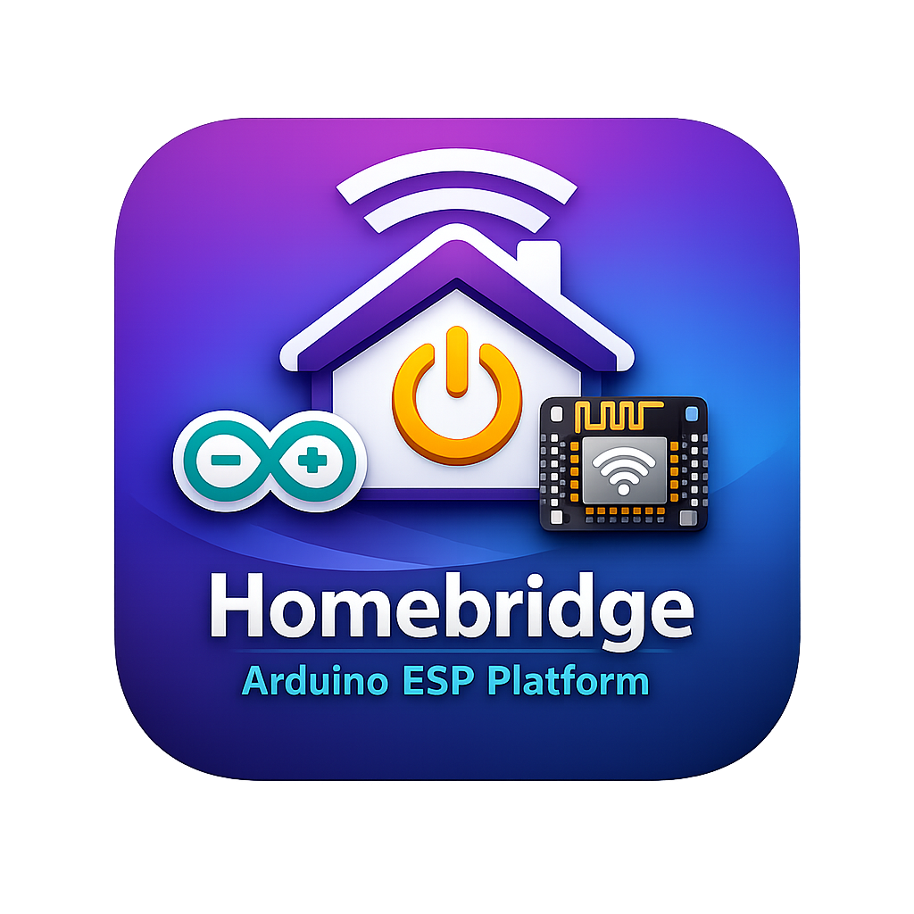

<div align="center">

  

  <br />

	[](https://github.com/homebridge/homebridge/wiki/Verified-Plugins)  

  <br />

#

  [](https://github.com/homebridge/homebridge/wiki/Verified-Plugins)
  [](https://github.com/Domi-Git-Hub/homebridge-arduino-esp-platform/releases)
  [](https://www.npmjs.com/package/homebridge-arduino-esp-platform)
  [](https://www.npmjs.com/package/homebridge-arduino-esp-platform)
  [](https://homebridge.io)
  [](LICENSE)

</div>

#

## Homebridge Arduino ESP Platform + PHP Server + Library Arduino IDE

A full project suite for **Homebridge + Arduino/ESP** with a **PHP/MySQL server**, **admin dashboard**, **user dashboard**, **token-per-project API**, and a **dynamic Homebridge platform plugin** using JSON per virtual pin.

### What is included

- `plugin/` → npm package `homebridge-arduino-esp-platform`
- `server/` → Apache/PHP/MySQL web app + HTTP/HTTPS JSON API
- `server/sql/schema.sql` → database schema + first admin account
- `server/apache/arduino-esp.conf` → Apache vhost example

### Main behavior

- One **user account** can own multiple **projects**.
- Every project gets a **server-generated token**.
- The token is used by Arduino/ESP and by the Homebridge plugin to read/write JSON per `VPin`.
- API endpoints:
  - `GET /TOKEN/get/V0`
  - `GET /TOKEN/update/V0?value={...}`
  - `POST /TOKEN/update/V0` with `value={...}`
- The plugin **adds required characteristics and selected optional characteristics** by probing the HAP service definition at runtime.
- For **irrigation systems**, the plugin creates the **Valve services first**, then links them to the **IrrigationSystem service** with `addLinkedService()`.
- Valve defaults include:
  - `Is Configured = 1`
  - `Service Label Index = 1..N`
  - `Set Duration` from config
  - `Remaining Duration = 0`
  - `Valve Type` from config
- The plugin **polls the server** and updates HomeKit when the server-side JSON changes.
- If a VPin does not exist yet, the plugin **seeds a full JSON object once** using the generated required/optional characteristic set.

### Example JSON

```json
{
  "Name": "light",
  "On": "0",
  "Brightness": "55",
  "Hue": "0",
  "Saturation": "0",
  "Color Temperature": "0"
}
```

### Example Homebridge config

```json
{
	"platform": "Arduino_ESP_Platform",
	"name": "Arduino ESP Platform",
	"serverurl": "http://IP-SERVER:8181",
	"pollerseconds": 1,
	"devices": [
		{
			"name": "Garden Controller",
			"token": "REPLACE_WITH_PROJECT_TOKEN",
			"deviceId": 1,
			"manufacturer": "Domi",
			"accessories": [
				{
					"model": "ESP-Light",
					"name": "Patio Light",
					"pinnumber": 0,
					"typeOf": "OUTLET",
					"characteristics": {
						"Name": true,
						"OutletInUse": true
					}
				},
				{
					"model": "ESP-Irrigation",
					"name": "Front Yard",
					"pinnumber": 3,
					"typeOf": "IRRIGATION_SYSTEM",
					"characteristics": {
						"Name": true,
						"RemainingDuration": true,
						"StatusFault": true
					},
					"valves": [
						{
							"valveName": "Zone 1",
							"valvePinNumber": 4,
							"valveType": 1,
							"valveSetDuration": 120,
							"characteristics": {
								"Name": true,
								"RemainingDuration": true,
								"SetDuration": true,
								"IsConfigured": true,
								"ServiceLabelIndex": true,
								"StatusFault": true
							}
						},
						{
							"valveName": "Zone 2",
							"valvePinNumber": 5,
							"valveType": 1,
							"valveSetDuration": 120,
							"characteristics": {
								"Name": true,
								"RemainingDuration": true,
								"SetDuration": true,
								"IsConfigured": true,
								"ServiceLabelIndex": true,
								"StatusFault": true
							}
						}
					]
				}
			]
		}
	],
	"debug": false,
	"_bridge": {
		"username": "0E:8D:EE:31:65:DA",
		"port": 33823,
		"name": "Arduino Esp Platform",
		"model": "ESP",
		"manufacturer": "Domi",
		"firmwareRevision": "1.0"
	}
}
```

---

## Plugin install

### 1) Copy the plugin

Place `plugin/` in its own git repository or directly in your Homebridge plugin development folder.

### 2) Install dependencies

This plugin intentionally uses **no external runtime dependency** and relies on Node 20+ built-in `fetch`.

### 3) Install in Homebridge

```bash
npm install -g homebridge-arduino-esp-platform
```

Then configure it from Homebridge UI using the included `config.schema.json`.

---

## Server install

### Requirements

- Apache 2.4+
- PHP 8.1+
- MySQL / MariaDB
- `mod_rewrite` enabled

### 1) Copy the server folder

Copy `arduino-esp-server` to your Apache document root, for example:

```bash
/var/www/arduino-esp-server
```

### 2) Create the database

Import:

```bash
mysql -u root -p < arduino-esp-server/sql/schema.sql
```

### 3) Configure the app

Copy:

```bash
cp arduino-esp-server/src/config.sample.php arduino-esp-server/src/config.php
```

Edit the database credentials and base URL.

### 4) Enable the Apache site

Copy `arduino-esp-server/apache/arduino-esp.conf` to `/etc/apache2/sites-available/arduino-esp.conf`

Create a symbolic link `sudo ln -s /etc/apache2/sites-available/arduino-esp.conf /etc/apache2/sites-enabled/arduino-esp.conf`

### 5) Open port 8181 in Apache2

sudo nano /etc/apache2/ports.conf

Add this line :

Listen 8181

For example, the file should become:

Listen 80
Listen 8181

<IfModule ssl_module>
    Listen 443
</IfModule>

<IfModule mod_gnutls.c>
    Listen 443
</IfModule>

### 6) Open the web UI

- Login page: `/`
- Admin page: `/admin.php`
- User dashboard: `/dashboard.php`

#### Default admin account

Created by `schema.sql`:

- **Username:** `admin`
- **Password:** `ChangeMe123!`

Change it immediately after first login.

---

## API usage

### Update a VPin

```bash
curl "http://IP-SERVER:8181/YOUR_TOKEN/update/V0?value={"Name":"Light","On":"1"}"
```

### Read a VPin

```bash
curl "http://IP-SERVER:8181/YOUR_TOKEN/get/V0"
```

### POST update

```bash
curl -X POST "http://IP-SERVER:8181/YOUR_TOKEN/update/V0" \
  -d 'value={"Name":"Light","On":"1"}'
```

---

## Notes

- The plugin keeps JSON keys aligned with the HomeKit characteristic display names.
- Missing values are auto-filled with defaults in memory.
- Unsupported complex HAP formats such as `tlv8` are added to the service when available, but the generic JSON bridge only binds simple primitive formats automatically.
- This keeps the code centralized and avoids scattered per-characteristic logic.
